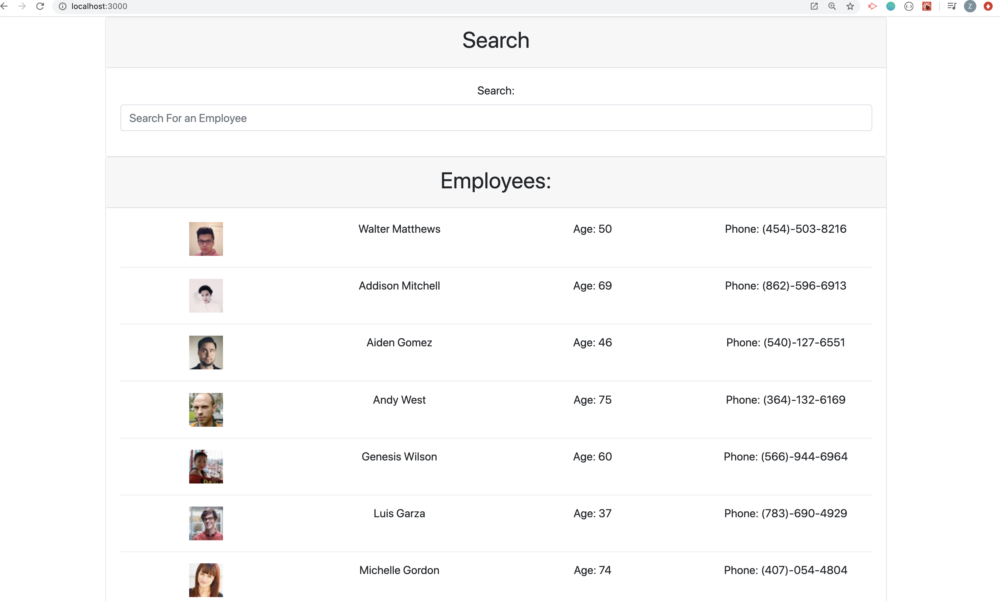
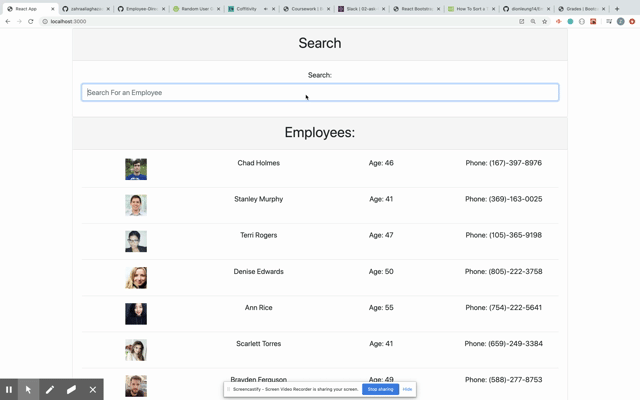

# [Employee Directory](https://yaldaemployeechart.herokuapp.com/)

## An application built with React , to display employee information

>This application to view the entire employee directory at once to have quick access to their information.


## Table of contents
* [General info](#general-info) 
* [Screenshots](#screenshots) 
* [Installation](#installation) 
* [Usage](#usage)
* [Credits](#credits)
* [Features](#features) 
* [Status](#status) 
* [License](#license) 
* [Contact](#contact)


## General Info
Employee Directory application is currently doing an api call to randomuser api to generate random list of employees and once you type in the search form it will sort the data.


## Screenshots


 


## Installation

To install : 
* [Visual Code](https://code.visualstudio.com/docs/setup/setup-overview)
* [NodeJS](https://nodejs.org/en/download/)


To use:


In order to install, first download the files. Then you would open terminal and type ```npm install``` . This will install all the npm packages listed under the dependencies in the package.json. Then you will type the command ``` npm start```. This will start the react app at the port 300 in the browser. Finally you will type ```localhost:3000``` in the browser window and use the application. 

## Usage 




To use this application, you can [click here](https://yaldaemployeechart.herokuapp.com/)


## Credits

This project was bootstrapped with [Create React App](https://github.com/facebook/create-react-app).

Initial readme instructions provided by [Triologyed](https://www.trilogyed.com/) <br>
Built with [Bootstrap](https://getbootstrap.com/)


## Features

* Feature 1: Easy to navigate design.
* Feature 2: Ability to search employee
* deployed with heroku.


To-do list:


*  UI desing can be improved.


## Status
Project is:  _finished_


## License

MIT license 
Copyright © 2020 Zahra Ali Aghazadeh


## Contact
Email: zahraaliaghazadeh@gmail.com

LinkedIn: [Zahra Ali Aghazadeh](https://www.linkedin.com/in/zahraaliaghazadeh)

feel free to contact me!

